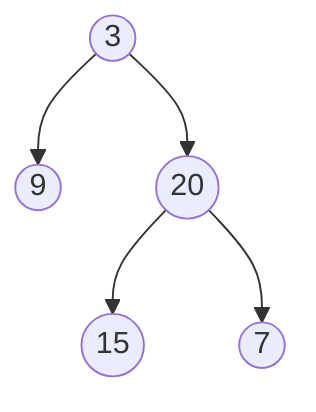

### Given a binary tree, find its maximum depth.

The maximum depth is the number of nodes along the longest path from the root node down to the farthest leaf node.

Note: A leaf is a node with no children.

Example:

Given binary tree [3,9,20,null,null,15,7],  
